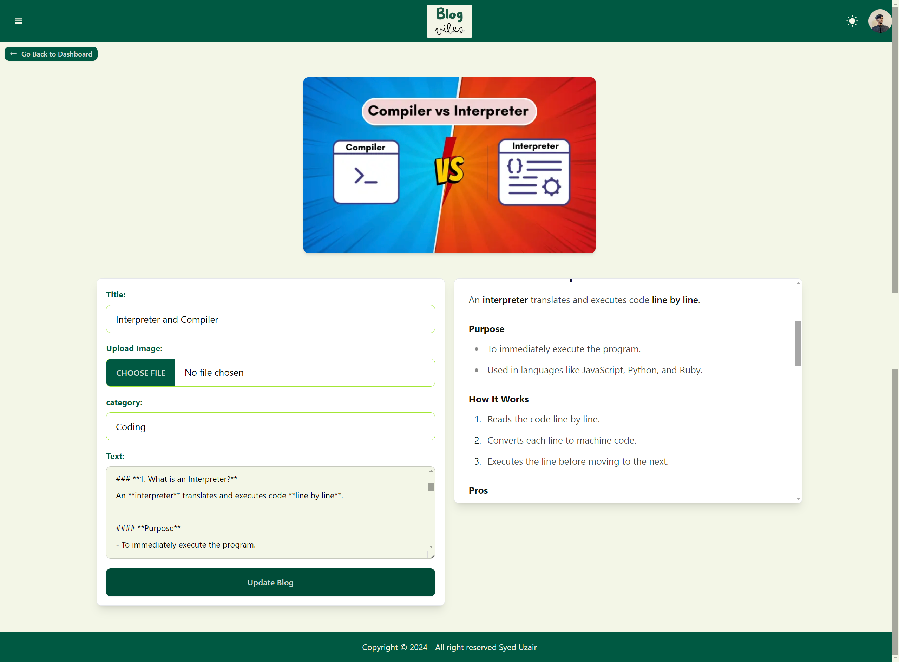
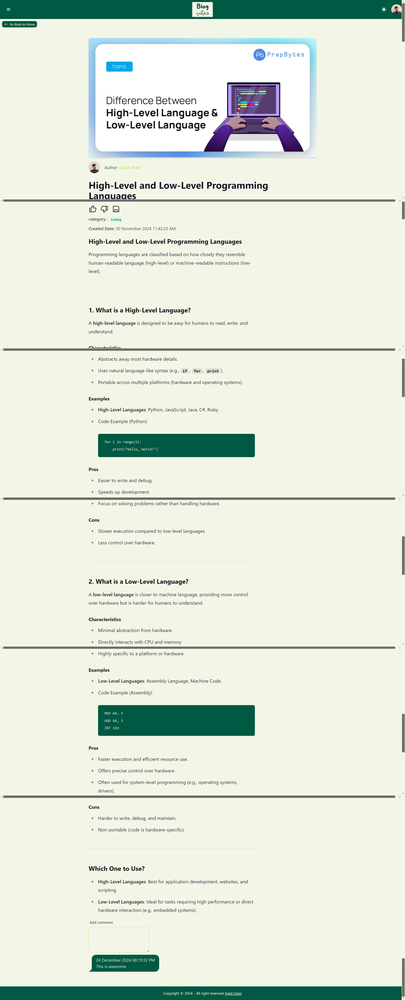

# Blog Vibes

**Blog Vibes** is a feature-rich blogging platform that allows users to view, like, and comment on blogs. It also includes an admin panel for managing blog content. Built with **Next.js**, **TypeScript**, and **Firebase**, this project leverages modern web development technologies for an engaging user experience.

## 🚀 Features

### General Features
- **View Blogs:** Browse and read blogs with a clean UI.
- **Like Blogs:** Show appreciation by liking blogs.
- **Save Blogs:** Save your favourite blogs.
- **Comment on Blogs:** Share your thoughts and engage in discussions through comments.

### Admin Features
- **Add Blogs:** Create new blogs through the admin panel.
- **Edit Blogs:** Update existing blog content.
- **Delete Blogs:** Remove blogs that are no longer needed.

## 🛠️ Technologies Used
- **Next.js**: For server-side rendering and a fast React-based frontend.
- **TypeScript**: Ensures type safety and better code maintainability.
- **Firebase**:
  - **Firestore**: Used as a real-time database for storing blogs, comments, and user information.
  - **Firebase Authentication**: Manages user sign-in and authentication.
  - **Firebase Hosting**: Hosts the application.

## 💡 Usage
- Sign in or create an account.
- Explore available blogs.
- Engage by liking and commenting on posts.
- Admins can log in to access features for managing blogs.

## 🎨 Styling
The app uses **Tailwind CSS** for styling, providing a modern, responsive design.

## 📸 Screenshots

### Dashboard

### Add Page

### Edit Page

### Admin can go to dashboard

### Confirmation

### Blog List Page

### Blog Detailed Page

### Register Page

---

## 🔗 Links
- [Live Demo](https://blogvibes.vercel.app)
- [Repository](https://github.com/uzairrehan/blog-vibes)
